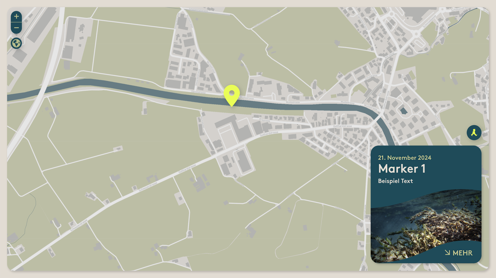
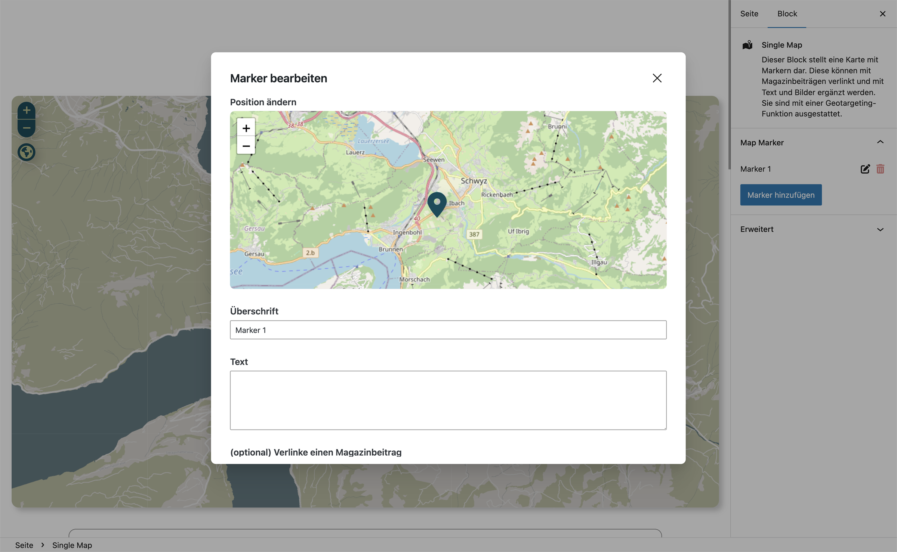

# UD Block: Muotamap

Ein interaktiver Karten-Block auf Basis von **Leaflet.js**, optimiert für die Anzeige und Verwaltung von Standorten oder Routen entlang der Muota.
Das Plugin integriert zwei Blöcke – eine **Einzelkarte** und eine **Sammlungskarte**.

## Funktionen

- **Zwei Block-Typen**
  - `muotamap/single-map` – zeigt eine einzelne Station oder Position
  - `muotamap/collection-map` – zeigt mehrere Punkte oder Standorte gemeinsam
- **Leaflet-Integration** mit OpenStreetMap-Tiles
- Dynamische Marker für Messstationen, Routen oder benutzerdefinierte Punkte
- **Routenanzeige & Navigation** via *Leaflet Routing Machine*
- Echtzeit-Aktualisierung über JSON- oder REST-Datenquellen möglich
- Anpassbares Design über globale Styles (`global.css`)
- Kompatibel mit **Full Site Editing (FSE)**

## Screenshots

*Darstellung im Frontend.*

Karte im Gutenberg-Editor mit Vorschau der Station oder Sammlung.*

## Technische Details

- Basierend auf **Leaflet.js** und **Leaflet Routing Machine**
- JavaScript-Dateien:
  - `leaflet.js` – Karten-Engine
  - `leaflet-routing-machine.js` – Routing-Erweiterung
  - `view.js` – Frontend-Logik (Initialisierung & Interaktion)
  - `edit.js` – Gutenberg-Integration
- PHP-Integration (`ud-muotamap.php`) registriert Skripte, Styles und Blöcke
- Unterstützt Block-Attribute und REST-basierte Datenübergabe
- Beide Blöcke verwenden einheitliche CSS-Struktur (`global.css`, `editor.css`)

## Installation

1. Plugin-Ordner `ud-muotamap-block` in `wp-content/plugins/` kopieren
2. Im WordPress-Backend unter **Plugins → Installierte Plugins** aktivieren
3. Im Block-Editor den Block **„UD Muotamap“** einfügen
4. Zwischen *Single Map* und *Collection Map* wählen
5. Marker oder Datenquelle konfigurieren

## Autor

[ulrich.digital gmbh](https://ulrich.digital)

## Lizenz

GPL v2 or later
[https://www.gnu.org/licenses/gpl-2.0.html](https://www.gnu.org/licenses/gpl-2.0.html)

